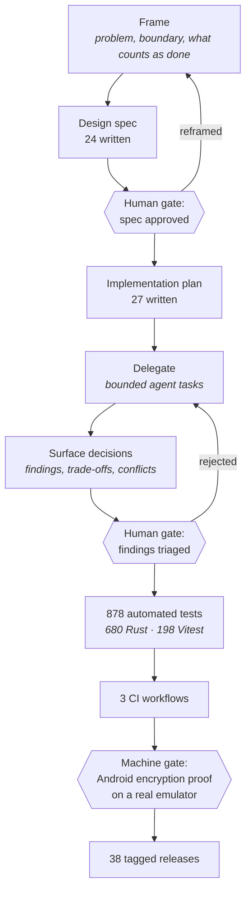

# Engineering practice

[`ARCHITECTURE.md`](ARCHITECTURE.md) describes how Jodd works — the trait
surface, the sync state machine, the cache that is the truth of the moment.
This document describes how it got built: the loop that produced that code,
what the loop's checkpoints actually caught, how two hard decisions were
worked through, and what the whole arrangement costs.

Jodd was written by one person directing AI copilots and task-specific
agents. That is worth stating plainly, because it explains the shape of
everything below — why there are written specifications before code, why the
gates are where they are, why the failure log is as long as it is. The model
names are the least interesting part and are deliberately absent: they change
every few months, and they are not what determines whether the output is
worth shipping. The operating model around them is. Every figure below is
reproduced by a script in this repository, with the command for each one
written beside it, and the two decisions in the middle are told with the
evidence that produced them — including the evidence that came out negative.

## The loop

Four steps, in order, per unit of work: **Frame → Delegate → Surface
decisions → Own the result.**

**Frame.** State the problem, the boundary, and what counts as done, before
any code is written. Most of the value of this step is the boundary: a task
whose edges are undefined is a task an agent will happily expand until the
diff is unreviewable.

**Delegate.** Hand out bounded pieces. The unit is a task a fresh agent with
no prior context can execute from the written plan alone — which is a real
constraint on how the plan has to be written, not a stylistic preference.

**Surface decisions.** The output that matters from a delegated task is not
the diff, it is the list of things the task had to decide, the trade-offs it
took, and anything it found that contradicts the plan. A task that reports
"done" and nothing else has hidden its decisions, not avoided them.

**Own the result.** Nothing merges on an agent's say-so. The human reads the
diff, and the automated gates run the same commands the merge gate runs.

## Why a spec comes before a plan

The two documents answer different questions and are approved by different
readers.

A **design spec** argues *what* is being built and *why*, including what is
explicitly out of scope and which alternatives were rejected. It is the
document a human approves, and rejecting it is cheap — the cost of a wrong
spec is the time spent writing it, not the time spent building the wrong
thing and then unbuilding it. Specs live in
[`docs/superpowers/specs/`](docs/superpowers/specs/) and are published with
the source.

An **implementation plan** answers *how*, decomposed into tasks each of which
can be executed by an agent that has read nothing else. That constraint is
what makes plans long and repetitive: every task carries its own file paths,
its own verification commands, and its own definition of done, because the
executor does not have the conversation that produced it.

Plans are deliberately **not** published. They are machine-facing execution
detail — the interesting content is in the spec that preceded them and the
code that came out. Publishing them would add volume without adding anything
a reader of this repository can use.

Both are written before code. This is real overhead, and the section on
[what this model costs](#what-this-model-costs) says where it is not worth
paying.

## What the gates have actually caught

An aspirational list of checks proves nothing. These two happened on this
project and are recorded in it. They are not both successes: the first was
caught by a machine gate after every human review had passed, and the second
was caught by no gate at all — it surfaced as behaviour someone had to
notice.

**A verification gate that differs from the merge gate only proves it agrees
with itself.** A function signature changed, leaving a probe binary under
`src-tauri/examples/` uncompilable. Every task review on the branch, a review
of the branch as a whole, and a subsequent fix pass all came back green —
because the
plan specified `cargo test -p jodd --lib`, which does not compile the
examples directory. CI runs workspace-wide `cargo test`, which does. The
failure surfaced on the main branch, as red CI, after every human and
automated check had passed. The fix was not more review; it was making the
verification command in every plan identical to the one CI runs.

**When background state changes on its own, decide how the UI learns before
writing either half.** The background sync worker began mutating an account's
status with no user command behind it — an account being drained flips itself
to inactive once its queue empties. Nothing told the frontend. A drained
account sat at "finishing sync — 0 left" indefinitely, and the Remove button
that appears only for inactive accounts never appeared. Every review passed
it, and each review was right to: the worker's half was correct on its own,
the UI's half was correct on its own, and the missing piece was a
notification channel that no document had ever specified. Reading existing
code cannot find a channel that does not exist. This class of defect is
caught at framing time or not at all.

## Two decisions, worked through

### Can Jodd create Apple Notes folders on a Microsoft account?

Jodd's Microsoft backend talks to an Exchange mailbox over the Graph API.
Notes write correctly there — create, edit, move, and delete all round-trip to
Apple Notes and to the iPhone, verified against a live account. (Pin is not in
that list. It is Jodd-only on every backend, as the feature table in
[`README.md`](README.md) says: on Microsoft it rides along as a named property
on the note's own message, which Graph round-trips and Apple ignores — the
measured result is that a note carrying it renders *normally* on iPhone, with
no pin.)
Folders do not, and the question was whether that was a gap to close or a
limit to record.

*What was tried.* Both folder-creation surfaces Graph exposes —
`POST /me/mailFolders` and `POST /me/mailFolders/{id}/childFolders` — and
then the one route those two leave open: create at mailbox root *with* the
sticky-note class requested, then `POST /me/mailFolders/{id}/move` it under
`Notes`. All three against a live account. The third is what makes the claim
below a closed set rather than two failures, and it is the one that could be
read back: `PR_CONTAINER_CLASS` came back `IPF.Note` on both the classed and
the unclassed folder, so the creation call had dropped the class either way.

*What was found.* Apple's Notes sync only displays a folder whose Exchange
container class is the sticky-note class. Neither Graph surface can set that
class on the folder it creates, and the class is immutable afterwards —
patching it returns `500 ErrorObjectTypeChanged`. There is no sequence of
Graph calls that produces a folder Apple will show.

*The control that ruled out a Jodd bug.* Folders created **by hand** in
Notes.app sync immediately, and notes written through Graph into one of those
hand-made folders reach Apple without issue. So the variable is folder
provenance, not note writing: the same code path that "fails" against a
Jodd-created folder succeeds against a hand-made one. Apple's own client can
set the container class because it is not going through Graph's restricted
surface to do it; a third-party OAuth application has no route to that
channel. Without this control the finding would have been "our folder writes
are broken," which is a bug report. With it, the finding is a property of the
platform.

*What shipped.* The folder-write capability is `false`, permanently, in
`Capabilities::for_backend` — the same descriptor
[`ARCHITECTURE.md`](ARCHITECTURE.md#the-capability-model) describes, in
`src-tauri/src/backend/mod.rs`. The folder-writing code exists and is
unit-tested; the capability gate keeps it switched off and the interface
stops offering the action. The evidence sits in the doc comment beside the
flag, so the next person to wonder finds the answer at the point of decision
rather than repeating the investigation.

The output of this decision was not a feature. It was a proven limit,
recorded as a capability value —
`Capabilities::for_backend(Microsoft).writes.folders` is `false` — that the
interface and the background sync worker both consult before acting, so the
limit holds even if one of the two is wrong: the sidebar declines to offer
folder writes, and the worker checks the same flag immediately before it
would turn a queued folder change into a live Graph call, dropping the row
instead. That is the difference between a limitation and a feature that
fails quietly on someone's phone.

*(The Microsoft backend's source ships in this snapshot, under
`src-tauri/src/backend/microsoft/`. What no release build carries is a
Microsoft OAuth client — `MS_CLIENT_ID` is read from the environment at
runtime and nothing embeds one at build time — so trying it means supplying
your own registered application's client id via the environment (or `.env`)
and restarting Jodd, not rebuilding it. See
[Status](README.md#status).)*

### The Android OAuth redirect chain

Signing in to Google from Android turned out to be four constraints in
series, three of which are invisible from — or contradicted by — the vendor's
own documentation. Any one of them, taken alone, produces a design that looks
correct and does not work.

**1. Custom URI schemes are documented and rejected.** Google's own Android
OAuth guidance describes registering a custom URI scheme as the redirect.
Google's servers now refuse it: `Error 400: Custom URI scheme is not enabled
for your Android client`. That single rejection makes an Android-type OAuth
client unusable for this flow, and the documentation still describing the
approach is what makes it expensive to discover.

**2. A port verified on one Android device is not verified.** The loopback
redirect — a short-lived HTTP listener on the device — completed a full
sign-in on an Android 13 handset. On a Galaxy S23 FE running Android 16 the
system killed Jodd while the consent screen was in the foreground, and a
listener in a dead process hears nothing. The same code, the same port, the
same account: one pass, one silent failure. Nothing in the first result
predicted the second, which is the actual lesson — a single-device pass on
Android is an anecdote, not a verification.

**3. Loopback was then removed from Android entirely, for a different
reason.** It binds `0.0.0.0:8080` — an unauthenticated HTTP server reachable
by every other application on the device for the duration of the flow. That
is unacceptable independently of whether it works, so it is compiled out of
the Android build rather than kept as a fallback. Desktop still uses it, and
the honest reason is not that the exposure is smaller there — desktop binds
the same address, reachable by every other process on the machine and by
anything on the same Wi-Fi. It is kept because the desktop flow cannot work
any other way. That is a statement about necessity, not about safety, and the
comment beside the listener in the source says so rather than dressing it up.

**4. Verified App Links still do not deliver the callback.** With the domain
verified and Digital Asset Links in place, the OAuth callback never arrives:
no VIEW intent is ever created. This is not a misconfiguration. Browsers
deliberately do not hand a navigation off to an app mid-redirect, and an
OAuth callback is precisely a server-side redirect mid-navigation. The
verification succeeding is what makes this one hard to diagnose — every
diagnostic says the link is correctly registered, and the intent still never
fires.

*What shipped.* A **web**-type OAuth client (an https redirect is required,
and a desktop-type client only accepts `http://localhost`), pointing at a
small redirect page that re-issues the authorization code as an `intent:` URL
naming Jodd's package — the one hand-off Android will actually perform. That
page is part of the OAuth flow, not marketing; it is deployed to
`jodd.bbmedia.co.th`, and removing it breaks sign-in with nothing in the
source tree to explain why, which is why it is documented in
[`docs/android/APP-LINKS-SETUP.md`](docs/android/APP-LINKS-SETUP.md).

One consequence worth recording: because the App Links intent frequently
cold-starts the app, the PKCE verifier has to survive process death. It is
written to the OS credential store when the flow starts, not held in memory.

## How these numbers were measured

Every figure published about this project comes from
[`scripts/showcase-metrics.sh`](scripts/showcase-metrics.sh), with the single
exception the table flags in its own right-hand column: the backend count,
which nothing in the tree can measure. Nothing else ships unless the script
reproduces it. Measured **2026-08-16**, at version **0.24.1**, against
upstream commit `72c312f` — the commit that introduced this document.

The git-derived rows name that commit rather than `HEAD` because a count of
commits cannot name the commit containing it: pinning to the one immediately
before this table was written is what makes the number reproducible *for
anyone holding the upstream repository* instead of true for a second. From
this repository it is not runnable at all — the public mirror is a squashed
single-commit snapshot, so no upstream sha resolves here. **Six of the
sixteen rows below can be re-derived from this repository alone** (the line
counts, the test counts, the workflow count); the other ten
need the upstream repository or measure inputs the public sync strips. Which
is which is spelled out under the table.

| Figure | Value | How it is measured |
|---|---|---|
| Commits | 790 | `git rev-list --count 72c312f` |
| First commit | 2026-06-03 | `git log --reverse --format=%ad --date=short 72c312f \| head -1` |
| Last commit | 2026-08-16 | `git log -1 --format=%ad --date=short 72c312f` |
| Days spanned | 74 | difference of the two dates above |
| Tagged releases | 38 | `git tag --merged 72c312f \| grep -c '^v'` |
| Rust lines | 36,611 | `find src-tauri/src jodd-mcp/src -name '*.rs' -exec cat {} + \| wc -l` |
| Frontend lines | 15,307 | `find src \( -name '*.svelte' -o -name '*.ts' \) -not -name '*.test.ts' -exec cat {} + \| wc -l` |
| Rust tests | 680 | `grep -rhE '^\s*#\[(tokio::)?test\]' src-tauri/src jodd-mcp/src \| wc -l` |
| Vitest tests | 198 | `find src -name '*.test.ts' -exec grep -hE '^\s*(it\|test)\(' {} + \| wc -l` |
| Tests, total | 878 | the two rows above, summed |
| Design specs | 24 | `git ls-tree -r --name-only 72c312f -- docs/superpowers/specs \| grep -c '\.md$'` |
| Implementation plans | 27 | `git ls-tree -r --name-only 72c312f -- docs/superpowers/plans \| grep -c '\.md$'` |
| Markdown docs | 75 | `git ls-tree -r --name-only 72c312f -- docs \| grep -c '\.md$'` |
| Recorded gotchas | 13 | `git show 72c312f:CLAUDE.md \| awk '/^## Gotchas that still bite/,/^## Open defects/' \| grep -cE '^[0-9]+\. \*\*'` — input not in this snapshot |
| CI workflows | 3 | `ls .github/workflows/*.yml \| wc -l` |
| Backend verticals | 3 | **not measured** — a hand-maintained literal in the script |

Six things about this table are worth saying out loud.

**Line counts and commit counts measure volume, not quality.** 36,611 lines
of Rust is not an achievement; it is a description of how much surface exists
for the test count and the specification count to apply to. Read those rows
as the denominator, not the result.

**The test counts are counts of test functions, not assertions or coverage.**
They are derived by counting `#[test]` attributes and `it(`/`test(` calls in
source, which is a close proxy for what the runners execute but not identical
to it. Neither number says anything about what fraction of the code those
tests reach.

**"Backend verticals: 3" is a hand-maintained literal**, flagged as such in
the script itself, because nothing in the tree enumerates "implemented
backends" the way `git ls-files` enumerates specs. It counts Gmail, Local
Folder, and Microsoft Graph, all three of which are in this snapshot's source
tree under `src-tauri/src/backend/`.

**Three figures measure inputs this repository does not contain.**
Implementation plans and `CLAUDE.md`, the internal working-notes file the
gotcha count is read from, are stripped on the way into the public snapshot.
The script does not quietly absorb that. `plans` and `gotchas` are each
guarded by a presence check, and with the input missing they print
`UNAVAILABLE (input not present in this checkout)` in place of a count;
`--check` then reports each as `UNAVAILABLE … baseline value N was not
verified`, tallies it separately from a drift, and still exits `0` — running
from a snapshot that lacks these inputs by design is an expected state, not a
failure. A silent `0` was the alternative, and it would have read as a real
measurement. The `docs` row behaves differently: it is measured normally here
and simply comes out lower than upstream, because the stripped plans are
themselves `.md` files underneath `docs/`. All three are stated because they
are load-bearing for the argument, not because a reader can check them from
this side.

**Six figures are measured upstream and cannot be run here.** Commits, first
commit, last commit, days spanned, and tagged releases all resolve a sha that
exists only in the private repository — this one is published as a squashed
snapshot with its history intentionally not preserved. Design specs joins
them for a related reason, discovered after the fact: a file count is just as
unpinnable as a commit count when its command names no commit, so
`git ls-files` was replaced with `git ls-tree` against the same sha the other
upstream rows already use. Together with the three stripped-input rows above
and the one hand-maintained literal, that is the ten; the remaining six are
the line counts, the test counts, and the workflow count, all of which a
reader reproduces by running the commands beside them here.

**Three figures are deliberately excluded from the script's own drift
check.** Commits, last-commit date, and days-spanned cannot be baselined,
because recording a value for them requires a commit and that commit changes
the value. There is no number you can write down that is still true after you
write it down — which is why the rows above name a commit instead of `HEAD`.
They are published; they are just not part of the script's pass/fail gate.

## What this model costs

**Writing a spec and a plan before code is real overhead, and for small
changes it is not worth paying.** 24 specs and 27 plans across 74 days is
roughly one written artifact every day and a half, on top of the code. Some
of them were for changes that would have been fine without them, and no rule
here reliably identifies in advance which ones those are. The honest position
is that this process taxes small work to protect large work, and the tax is
sometimes wasted.

**Agents produce confident, wrong output, and catching it requires a
reviewer who could have written the code.** The failure mode is not
gibberish, which would be easy. It is plausible code carrying a wrong
assumption, delivered with a summary asserting a verification that did not
happen — the examples-directory failure above is exactly this, and it passed
every review on its branch. This model **raises** the bar on the human rather
than lowering it: it increases the volume of code that has to be judged while
removing the author's own memory of writing it. Someone who cannot tell a
correct diff from a convincing one gets worse results from this process than
from writing the code by hand.

**The recorded failures exist because the process did not prevent them.**
Thirteen gotchas are written down in this project's working notes. Every one
is a failure that got through the reviews meant to stop it and was recorded
afterwards. The recording is genuinely valuable — it is why the same mistake
is not made twice — but reading the list as evidence of rigor inverts it. It
is a list of what rigor missed.

**A gate can be believed for longer than it is real.** The Android
encryption proof — a SQLCipher round-trip run on an actual emulator, because
passing the same test on a development machine says nothing about whether
vendored OpenSSL cross-compiled with the NDK works on a real device — is
wired into the publishing job now. It failed on every run from the day it
was added, first on runner disk space, then on emulator boot, and a release
shipped anyway, because the job that publishes to the public repository did
not list it as a dependency. It was read as gating for as long as it was
red, by the person who wrote it. A job believed to be blocking while it is
failing is worse than no job at all, because it consumes the attention a
real gate would have earned. The fix was applied after the fact, not a
process that prevented the problem.

**No second human has reviewed any of this.** The commit log has one author
under three spellings of the same name. Every review in the loop above is
either the same person who framed the work or an agent — and an agent
reviewing agent output is not an independent check. This is the largest
unmitigated weakness in the model as practised here, and nothing in the gate
structure substitutes for it.

**Some of the work produces no feature.** The Microsoft folder-writes
investigation above cost days and shipped a `false`. The code was written,
unit-tested, and switched off. That was the right outcome, and it is still
days spent to arrive at a capability the product does not have.
